# Introduction
Another chapter in my Kaggle competitons era. This notebook tries to apply what I've learned so far about building an elementary ML model.

#### **Evaluation Metric**

Submissions are evaluated based on their classification accuracy, the percentage of predicted labels that are correct.

**Results:**
- V1: 16843.63326


### Imports


```python
# Core
import pandas as pd
import numpy as np
from sklearn.model_selection import train_test_split, GroupShuffleSplit
from sklearn.preprocessing import StandardScaler, OneHotEncoder, PowerTransformer
from sklearn.compose import make_column_transformer
from sklearn.impute import SimpleImputer

from sklearn.metrics import mean_absolute_error

from sklearn.linear_model import Lasso
from sklearn.linear_model import LinearRegression
from sklearn.linear_model import Ridge
from sklearn.linear_model import ElasticNet
from sklearn.neighbors import KNeighborsRegressor
from sklearn.svm import SVR
from sklearn.ensemble import RandomForestRegressor
from sklearn.ensemble import GradientBoostingRegressor
from sklearn.ensemble import AdaBoostRegressor
from sklearn.tree import DecisionTreeRegressor
from xgboost import XGBRegressor

from tensorflow import keras
from keras import layers
from keras import callbacks

# Data Visualisation
import matplotlib.pyplot as plt
import seaborn as sns
%matplotlib inline
```

### Reading Data Inputs


```python
# !unzip data/home-data-for-ml-course.zip -d data/

test = pd.read_csv("data/test.csv")
train = pd.read_csv("data/train.csv")
pd.set_option("display.max_rows", None)
```

# 1. Exploratory Data Analysis
## 1.1 Preliminary Observations


```python
print("train: ", train.shape)
train.head(5)
```

    train:  (1460, 81)


<div>
<table border="1" class="dataframe">
  <thead>
    <tr style="text-align: right;">
      <th></th>
      <th>Id</th>
      <th>MSSubClass</th>
      <th>MSZoning</th>
      <th>LotFrontage</th>
      <th>LotArea</th>
      <th>Street</th>
      <th>Alley</th>
      <th>LotShape</th>
      <th>LandContour</th>
      <th>Utilities</th>
      <th>...</th>
      <th>PoolArea</th>
      <th>PoolQC</th>
      <th>Fence</th>
      <th>MiscFeature</th>
      <th>MiscVal</th>
      <th>MoSold</th>
      <th>YrSold</th>
      <th>SaleType</th>
      <th>SaleCondition</th>
      <th>SalePrice</th>
    </tr>
  </thead>
  <tbody>
    <tr>
      <th>0</th>
      <td>1</td>
      <td>60</td>
      <td>RL</td>
      <td>65.0</td>
      <td>8450</td>
      <td>Pave</td>
      <td>NaN</td>
      <td>Reg</td>
      <td>Lvl</td>
      <td>AllPub</td>
      <td>...</td>
      <td>0</td>
      <td>NaN</td>
      <td>NaN</td>
      <td>NaN</td>
      <td>0</td>
      <td>2</td>
      <td>2008</td>
      <td>WD</td>
      <td>Normal</td>
      <td>208500</td>
    </tr>
    <tr>
      <th>1</th>
      <td>2</td>
      <td>20</td>
      <td>RL</td>
      <td>80.0</td>
      <td>9600</td>
      <td>Pave</td>
      <td>NaN</td>
      <td>Reg</td>
      <td>Lvl</td>
      <td>AllPub</td>
      <td>...</td>
      <td>0</td>
      <td>NaN</td>
      <td>NaN</td>
      <td>NaN</td>
      <td>0</td>
      <td>5</td>
      <td>2007</td>
      <td>WD</td>
      <td>Normal</td>
      <td>181500</td>
    </tr>
    <tr>
      <th>2</th>
      <td>3</td>
      <td>60</td>
      <td>RL</td>
      <td>68.0</td>
      <td>11250</td>
      <td>Pave</td>
      <td>NaN</td>
      <td>IR1</td>
      <td>Lvl</td>
      <td>AllPub</td>
      <td>...</td>
      <td>0</td>
      <td>NaN</td>
      <td>NaN</td>
      <td>NaN</td>
      <td>0</td>
      <td>9</td>
      <td>2008</td>
      <td>WD</td>
      <td>Normal</td>
      <td>223500</td>
    </tr>
    <tr>
      <th>3</th>
      <td>4</td>
      <td>70</td>
      <td>RL</td>
      <td>60.0</td>
      <td>9550</td>
      <td>Pave</td>
      <td>NaN</td>
      <td>IR1</td>
      <td>Lvl</td>
      <td>AllPub</td>
      <td>...</td>
      <td>0</td>
      <td>NaN</td>
      <td>NaN</td>
      <td>NaN</td>
      <td>0</td>
      <td>2</td>
      <td>2006</td>
      <td>WD</td>
      <td>Abnorml</td>
      <td>140000</td>
    </tr>
    <tr>
      <th>4</th>
      <td>5</td>
      <td>60</td>
      <td>RL</td>
      <td>84.0</td>
      <td>14260</td>
      <td>Pave</td>
      <td>NaN</td>
      <td>IR1</td>
      <td>Lvl</td>
      <td>AllPub</td>
      <td>...</td>
      <td>0</td>
      <td>NaN</td>
      <td>NaN</td>
      <td>NaN</td>
      <td>0</td>
      <td>12</td>
      <td>2008</td>
      <td>WD</td>
      <td>Normal</td>
      <td>250000</td>
    </tr>
  </tbody>
</table>
<p>5 rows × 81 columns</p>
</div>


```python
print(train.info())
```

    <class 'pandas.core.frame.DataFrame'>
    RangeIndex: 1460 entries, 0 to 1459
    Data columns (total 81 columns):
     #   Column         Non-Null Count  Dtype  
    ---  ------         --------------  -----  
     0   Id             1460 non-null   int64  
     1   MSSubClass     1460 non-null   int64  
     2   MSZoning       1460 non-null   object 
     3   LotFrontage    1201 non-null   float64
     4   LotArea        1460 non-null   int64  
     5   Street         1460 non-null   object 
     6   Alley          91 non-null     object 
     7   LotShape       1460 non-null   object 
     8   LandContour    1460 non-null   object 
     9   Utilities      1460 non-null   object 
     10  LotConfig      1460 non-null   object 
     11  LandSlope      1460 non-null   object 
     12  Neighborhood   1460 non-null   object 
     13  Condition1     1460 non-null   object 
     14  Condition2     1460 non-null   object 
     15  BldgType       1460 non-null   object 
     16  HouseStyle     1460 non-null   object 
     17  OverallQual    1460 non-null   int64  
     18  OverallCond    1460 non-null   int64  
     19  YearBuilt      1460 non-null   int64  
     20  YearRemodAdd   1460 non-null   int64  
     21  RoofStyle      1460 non-null   object 
     22  RoofMatl       1460 non-null   object 
     23  Exterior1st    1460 non-null   object 
     24  Exterior2nd    1460 non-null   object 
     25  MasVnrType     588 non-null    object 
     26  MasVnrArea     1452 non-null   float64
     27  ExterQual      1460 non-null   object 
     28  ExterCond      1460 non-null   object 
     29  Foundation     1460 non-null   object 
     30  BsmtQual       1423 non-null   object 
     31  BsmtCond       1423 non-null   object 
     32  BsmtExposure   1422 non-null   object 
     33  BsmtFinType1   1423 non-null   object 
     34  BsmtFinSF1     1460 non-null   int64  
     35  BsmtFinType2   1422 non-null   object 
     36  BsmtFinSF2     1460 non-null   int64  
     37  BsmtUnfSF      1460 non-null   int64  
     38  TotalBsmtSF    1460 non-null   int64  
     39  Heating        1460 non-null   object 
     40  HeatingQC      1460 non-null   object 
     41  CentralAir     1460 non-null   object 
     42  Electrical     1459 non-null   object 
     43  1stFlrSF       1460 non-null   int64  
     44  2ndFlrSF       1460 non-null   int64  
     45  LowQualFinSF   1460 non-null   int64  
     46  GrLivArea      1460 non-null   int64  
     47  BsmtFullBath   1460 non-null   int64  
     48  BsmtHalfBath   1460 non-null   int64  
     49  FullBath       1460 non-null   int64  
     50  HalfBath       1460 non-null   int64  
     51  BedroomAbvGr   1460 non-null   int64  
     52  KitchenAbvGr   1460 non-null   int64  
     53  KitchenQual    1460 non-null   object 
     54  TotRmsAbvGrd   1460 non-null   int64  
     55  Functional     1460 non-null   object 
     56  Fireplaces     1460 non-null   int64  
     57  FireplaceQu    770 non-null    object 
     58  GarageType     1379 non-null   object 
     59  GarageYrBlt    1379 non-null   float64
     60  GarageFinish   1379 non-null   object 
     61  GarageCars     1460 non-null   int64  
     62  GarageArea     1460 non-null   int64  
     63  GarageQual     1379 non-null   object 
     64  GarageCond     1379 non-null   object 
     65  PavedDrive     1460 non-null   object 
     66  WoodDeckSF     1460 non-null   int64  
     67  OpenPorchSF    1460 non-null   int64  
     68  EnclosedPorch  1460 non-null   int64  
     69  3SsnPorch      1460 non-null   int64  
     70  ScreenPorch    1460 non-null   int64  
     71  PoolArea       1460 non-null   int64  
     72  PoolQC         7 non-null      object 
     73  Fence          281 non-null    object 
     74  MiscFeature    54 non-null     object 
     75  MiscVal        1460 non-null   int64  
     76  MoSold         1460 non-null   int64  
     77  YrSold         1460 non-null   int64  
     78  SaleType       1460 non-null   object 
     79  SaleCondition  1460 non-null   object 
     80  SalePrice      1460 non-null   int64  
    dtypes: float64(3), int64(35), object(43)
    memory usage: 924.0+ KB
    None


```python
train.isna().mean().sort_values(ascending=False)
```


    PoolQC           0.995205
    MiscFeature      0.963014
    Alley            0.937671
    Fence            0.807534
    MasVnrType       0.597260
    FireplaceQu      0.472603
    LotFrontage      0.177397
    GarageYrBlt      0.055479
    GarageCond       0.055479
    GarageType       0.055479
    GarageFinish     0.055479
    GarageQual       0.055479
    BsmtFinType2     0.026027
    BsmtExposure     0.026027
    BsmtQual         0.025342
    BsmtCond         0.025342
    BsmtFinType1     0.025342
    MasVnrArea       0.005479
    Electrical       0.000685
    Id               0.000000
    Functional       0.000000
    Fireplaces       0.000000
    KitchenQual      0.000000
    KitchenAbvGr     0.000000
    BedroomAbvGr     0.000000
    HalfBath         0.000000
    FullBath         0.000000
    BsmtHalfBath     0.000000
    TotRmsAbvGrd     0.000000
    GarageCars       0.000000
    GrLivArea        0.000000
    GarageArea       0.000000
    PavedDrive       0.000000
    WoodDeckSF       0.000000
    OpenPorchSF      0.000000
    EnclosedPorch    0.000000
    3SsnPorch        0.000000
    ScreenPorch      0.000000
    PoolArea         0.000000
    MiscVal          0.000000
    MoSold           0.000000
    YrSold           0.000000
    SaleType         0.000000
    SaleCondition    0.000000
    BsmtFullBath     0.000000
    HeatingQC        0.000000
    LowQualFinSF     0.000000
    LandSlope        0.000000
    OverallQual      0.000000
    HouseStyle       0.000000
    BldgType         0.000000
    Condition2       0.000000
    Condition1       0.000000
    Neighborhood     0.000000
    LotConfig        0.000000
    YearBuilt        0.000000
    Utilities        0.000000
    LandContour      0.000000
    LotShape         0.000000
    Street           0.000000
    LotArea          0.000000
    MSZoning         0.000000
    OverallCond      0.000000
    YearRemodAdd     0.000000
    2ndFlrSF         0.000000
    BsmtFinSF2       0.000000
    1stFlrSF         0.000000
    CentralAir       0.000000
    MSSubClass       0.000000
    Heating          0.000000
    TotalBsmtSF      0.000000
    BsmtUnfSF        0.000000
    BsmtFinSF1       0.000000
    RoofStyle        0.000000
    Foundation       0.000000
    ExterCond        0.000000
    ExterQual        0.000000
    Exterior2nd      0.000000
    Exterior1st      0.000000
    RoofMatl         0.000000
    SalePrice        0.000000
    dtype: float64


```python
print("test: ", test.shape)
test.head(5)
```

    test:  (1459, 80)


<div>
<table border="1" class="dataframe">
  <thead>
    <tr style="text-align: right;">
      <th></th>
      <th>Id</th>
      <th>MSSubClass</th>
      <th>MSZoning</th>
      <th>LotFrontage</th>
      <th>LotArea</th>
      <th>Street</th>
      <th>Alley</th>
      <th>LotShape</th>
      <th>LandContour</th>
      <th>Utilities</th>
      <th>...</th>
      <th>ScreenPorch</th>
      <th>PoolArea</th>
      <th>PoolQC</th>
      <th>Fence</th>
      <th>MiscFeature</th>
      <th>MiscVal</th>
      <th>MoSold</th>
      <th>YrSold</th>
      <th>SaleType</th>
      <th>SaleCondition</th>
    </tr>
  </thead>
  <tbody>
    <tr>
      <th>0</th>
      <td>1461</td>
      <td>20</td>
      <td>RH</td>
      <td>80.0</td>
      <td>11622</td>
      <td>Pave</td>
      <td>NaN</td>
      <td>Reg</td>
      <td>Lvl</td>
      <td>AllPub</td>
      <td>...</td>
      <td>120</td>
      <td>0</td>
      <td>NaN</td>
      <td>MnPrv</td>
      <td>NaN</td>
      <td>0</td>
      <td>6</td>
      <td>2010</td>
      <td>WD</td>
      <td>Normal</td>
    </tr>
    <tr>
      <th>1</th>
      <td>1462</td>
      <td>20</td>
      <td>RL</td>
      <td>81.0</td>
      <td>14267</td>
      <td>Pave</td>
      <td>NaN</td>
      <td>IR1</td>
      <td>Lvl</td>
      <td>AllPub</td>
      <td>...</td>
      <td>0</td>
      <td>0</td>
      <td>NaN</td>
      <td>NaN</td>
      <td>Gar2</td>
      <td>12500</td>
      <td>6</td>
      <td>2010</td>
      <td>WD</td>
      <td>Normal</td>
    </tr>
    <tr>
      <th>2</th>
      <td>1463</td>
      <td>60</td>
      <td>RL</td>
      <td>74.0</td>
      <td>13830</td>
      <td>Pave</td>
      <td>NaN</td>
      <td>IR1</td>
      <td>Lvl</td>
      <td>AllPub</td>
      <td>...</td>
      <td>0</td>
      <td>0</td>
      <td>NaN</td>
      <td>MnPrv</td>
      <td>NaN</td>
      <td>0</td>
      <td>3</td>
      <td>2010</td>
      <td>WD</td>
      <td>Normal</td>
    </tr>
    <tr>
      <th>3</th>
      <td>1464</td>
      <td>60</td>
      <td>RL</td>
      <td>78.0</td>
      <td>9978</td>
      <td>Pave</td>
      <td>NaN</td>
      <td>IR1</td>
      <td>Lvl</td>
      <td>AllPub</td>
      <td>...</td>
      <td>0</td>
      <td>0</td>
      <td>NaN</td>
      <td>NaN</td>
      <td>NaN</td>
      <td>0</td>
      <td>6</td>
      <td>2010</td>
      <td>WD</td>
      <td>Normal</td>
    </tr>
    <tr>
      <th>4</th>
      <td>1465</td>
      <td>120</td>
      <td>RL</td>
      <td>43.0</td>
      <td>5005</td>
      <td>Pave</td>
      <td>NaN</td>
      <td>IR1</td>
      <td>HLS</td>
      <td>AllPub</td>
      <td>...</td>
      <td>144</td>
      <td>0</td>
      <td>NaN</td>
      <td>NaN</td>
      <td>NaN</td>
      <td>0</td>
      <td>1</td>
      <td>2010</td>
      <td>WD</td>
      <td>Normal</td>
    </tr>
  </tbody>
</table>
<p>5 rows × 80 columns</p>
</div>


```python
print(test.info())
```

    <class 'pandas.core.frame.DataFrame'>
    RangeIndex: 1459 entries, 0 to 1458
    Data columns (total 80 columns):
     #   Column         Non-Null Count  Dtype  
    ---  ------         --------------  -----  
     0   Id             1459 non-null   int64  
     1   MSSubClass     1459 non-null   int64  
     2   MSZoning       1455 non-null   object 
     3   LotFrontage    1232 non-null   float64
     4   LotArea        1459 non-null   int64  
     5   Street         1459 non-null   object 
     6   Alley          107 non-null    object 
     7   LotShape       1459 non-null   object 
     8   LandContour    1459 non-null   object 
     9   Utilities      1457 non-null   object 
     10  LotConfig      1459 non-null   object 
     11  LandSlope      1459 non-null   object 
     12  Neighborhood   1459 non-null   object 
     13  Condition1     1459 non-null   object 
     14  Condition2     1459 non-null   object 
     15  BldgType       1459 non-null   object 
     16  HouseStyle     1459 non-null   object 
     17  OverallQual    1459 non-null   int64  
     18  OverallCond    1459 non-null   int64  
     19  YearBuilt      1459 non-null   int64  
     20  YearRemodAdd   1459 non-null   int64  
     21  RoofStyle      1459 non-null   object 
     22  RoofMatl       1459 non-null   object 
     23  Exterior1st    1458 non-null   object 
     24  Exterior2nd    1458 non-null   object 
     25  MasVnrType     565 non-null    object 
     26  MasVnrArea     1444 non-null   float64
     27  ExterQual      1459 non-null   object 
     28  ExterCond      1459 non-null   object 
     29  Foundation     1459 non-null   object 
     30  BsmtQual       1415 non-null   object 
     31  BsmtCond       1414 non-null   object 
     32  BsmtExposure   1415 non-null   object 
     33  BsmtFinType1   1417 non-null   object 
     34  BsmtFinSF1     1458 non-null   float64
     35  BsmtFinType2   1417 non-null   object 
     36  BsmtFinSF2     1458 non-null   float64
     37  BsmtUnfSF      1458 non-null   float64
     38  TotalBsmtSF    1458 non-null   float64
     39  Heating        1459 non-null   object 
     40  HeatingQC      1459 non-null   object 
     41  CentralAir     1459 non-null   object 
     42  Electrical     1459 non-null   object 
     43  1stFlrSF       1459 non-null   int64  
     44  2ndFlrSF       1459 non-null   int64  
     45  LowQualFinSF   1459 non-null   int64  
     46  GrLivArea      1459 non-null   int64  
     47  BsmtFullBath   1457 non-null   float64
     48  BsmtHalfBath   1457 non-null   float64
     49  FullBath       1459 non-null   int64  
     50  HalfBath       1459 non-null   int64  
     51  BedroomAbvGr   1459 non-null   int64  
     52  KitchenAbvGr   1459 non-null   int64  
     53  KitchenQual    1458 non-null   object 
     54  TotRmsAbvGrd   1459 non-null   int64  
     55  Functional     1457 non-null   object 
     56  Fireplaces     1459 non-null   int64  
     57  FireplaceQu    729 non-null    object 
     58  GarageType     1383 non-null   object 
     59  GarageYrBlt    1381 non-null   float64
     60  GarageFinish   1381 non-null   object 
     61  GarageCars     1458 non-null   float64
     62  GarageArea     1458 non-null   float64
     63  GarageQual     1381 non-null   object 
     64  GarageCond     1381 non-null   object 
     65  PavedDrive     1459 non-null   object 
     66  WoodDeckSF     1459 non-null   int64  
     67  OpenPorchSF    1459 non-null   int64  
     68  EnclosedPorch  1459 non-null   int64  
     69  3SsnPorch      1459 non-null   int64  
     70  ScreenPorch    1459 non-null   int64  
     71  PoolArea       1459 non-null   int64  
     72  PoolQC         3 non-null      object 
     73  Fence          290 non-null    object 
     74  MiscFeature    51 non-null     object 
     75  MiscVal        1459 non-null   int64  
     76  MoSold         1459 non-null   int64  
     77  YrSold         1459 non-null   int64  
     78  SaleType       1458 non-null   object 
     79  SaleCondition  1459 non-null   object 
    dtypes: float64(11), int64(26), object(43)
    memory usage: 912.0+ KB
    None


```python
# List of numerical features
num_features = train.select_dtypes(exclude='object').copy()
print("Number of numerical features: ", len(num_features.columns))
num_features.columns
```

    Number of numerical features:  38


    Index(['Id', 'MSSubClass', 'LotFrontage', 'LotArea', 'OverallQual',
           'OverallCond', 'YearBuilt', 'YearRemodAdd', 'MasVnrArea', 'BsmtFinSF1',
           'BsmtFinSF2', 'BsmtUnfSF', 'TotalBsmtSF', '1stFlrSF', '2ndFlrSF',
           'LowQualFinSF', 'GrLivArea', 'BsmtFullBath', 'BsmtHalfBath', 'FullBath',
           'HalfBath', 'BedroomAbvGr', 'KitchenAbvGr', 'TotRmsAbvGrd',
           'Fireplaces', 'GarageYrBlt', 'GarageCars', 'GarageArea', 'WoodDeckSF',
           'OpenPorchSF', 'EnclosedPorch', '3SsnPorch', 'ScreenPorch', 'PoolArea',
           'MiscVal', 'MoSold', 'YrSold', 'SalePrice'],
          dtype='object')


```python
# List of non-numerical features
cat_features = train.select_dtypes(include='object').copy()
print("Number of categorical features: ", len(cat_features.columns))
cat_features.columns
```

    Number of categorical features:  43


    Index(['MSZoning', 'Street', 'Alley', 'LotShape', 'LandContour', 'Utilities',
           'LotConfig', 'LandSlope', 'Neighborhood', 'Condition1', 'Condition2',
           'BldgType', 'HouseStyle', 'RoofStyle', 'RoofMatl', 'Exterior1st',
           'Exterior2nd', 'MasVnrType', 'ExterQual', 'ExterCond', 'Foundation',
           'BsmtQual', 'BsmtCond', 'BsmtExposure', 'BsmtFinType1', 'BsmtFinType2',
           'Heating', 'HeatingQC', 'CentralAir', 'Electrical', 'KitchenQual',
           'Functional', 'FireplaceQu', 'GarageType', 'GarageFinish', 'GarageQual',
           'GarageCond', 'PavedDrive', 'PoolQC', 'Fence', 'MiscFeature',
           'SaleType', 'SaleCondition'],
          dtype='object')


## 1.2 Univariate Analysis


```python
plt.figure()
sns.histplot(
    train.SalePrice, kde=True,
    stat="percent", kde_kws=dict(cut=3),
    alpha=.4, edgecolor=(1, 1, 1, .4)
)
plt.title('Distribution of SalePrice')
plt.show()
```


    
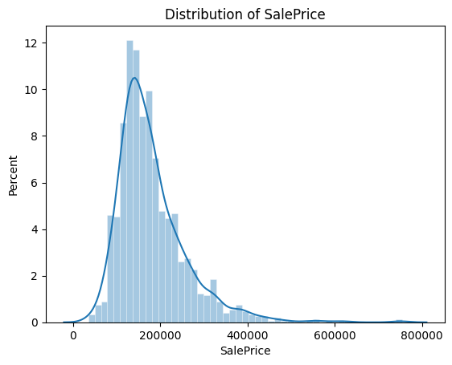
    


#### Note for Data Cleaning
Adjust and predict for a normal dist SalePrice. Convert back to normal after.


```python
fig = plt.figure(figsize=(24,26))
for i in range(1, 37):
    fig.add_subplot(9,4,i)
    sns.histplot(
    num_features.iloc[:,i].dropna(), kde=True,
    stat="density", kde_kws=dict(cut=3),
    alpha=.4, edgecolor=(1, 1, 1, .4)
)
    plt.xlabel(num_features.columns[i])

plt.tight_layout(pad=1.0)
```


    
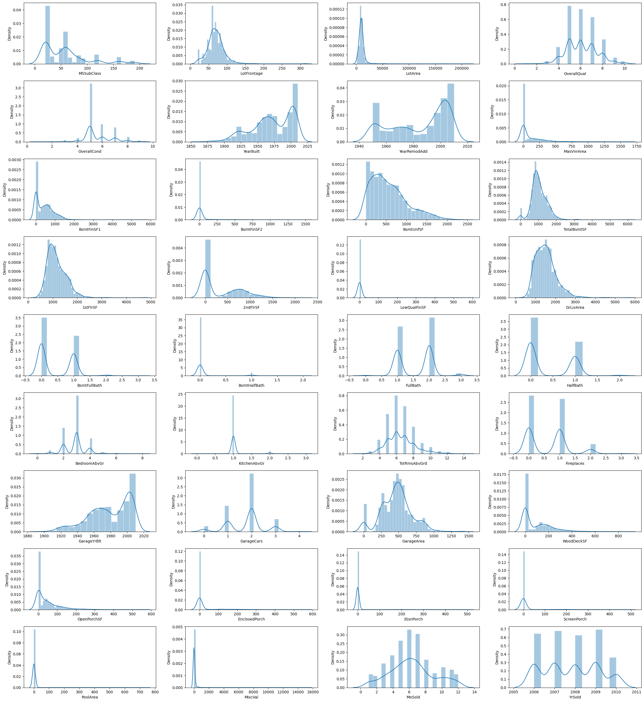
    


```python
cont_num_var = ['LotFrontage', 'LotArea', 'MasVnrArea', 'BsmtFinSF1',
       'BsmtFinSF2', 'BsmtUnfSF', 'TotalBsmtSF', '1stFlrSF', '2ndFlrSF',
       'LowQualFinSF', 'GrLivArea', 'GarageArea', 'WoodDeckSF',
       'OpenPorchSF', 'EnclosedPorch', '3SsnPorch', 'ScreenPorch', 'PoolArea',
       'MiscVal']

disc_num_var = list(set(num_features.columns) - set(cont_num_var) - set(['Id', 'SalePrice']))
```


```python
fig = plt.figure(figsize=(24,26))
for i in range(len(cont_num_var)):
    fig.add_subplot(9,4,i+1)
    sns.histplot(
    num_features[cont_num_var].iloc[:,i], kde=True,
    stat="density", kde_kws=dict(cut=3),
    alpha=.4, edgecolor=(1, 1, 1, .4)
)
    plt.xlabel(num_features[cont_num_var].columns[i])

plt.tight_layout(pad=1.0)
```


    
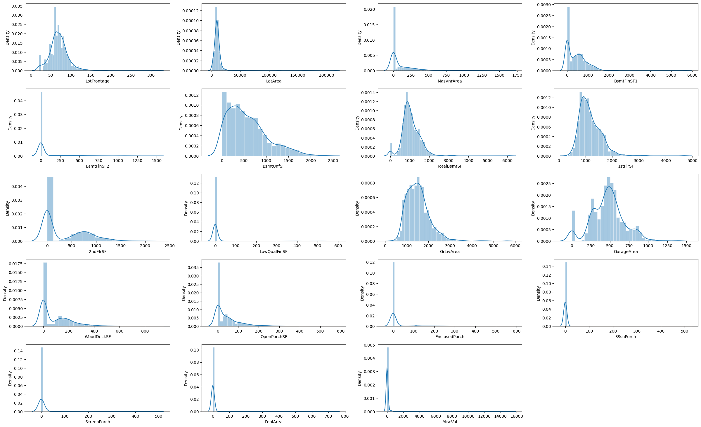
    


#### Note for Data Cleaning
Adjust and normalize continous numerical features. using log-transform preserves importance of 0


```python
fig = plt.figure(figsize=(18,20))
for index in range(len(cat_features.columns)):
    plt.subplot(9,5,index+1)
    sns.countplot(x=cat_features.iloc[:,index], data=cat_features)
    plt.xticks(rotation=90)
fig.tight_layout(pad=1.0)
```


    
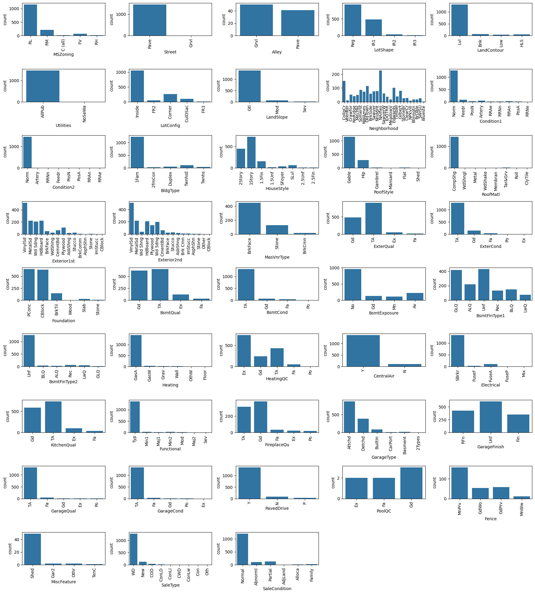
    


## Bivariate Analysis


```python
plt.figure(figsize=(15,12))
correlation = num_features.corr()
sns.heatmap(correlation, linewidth=0.5, linecolor="gray", cmap="Blues", vmin=-1, vmax=1)
```


    <Axes: >


    
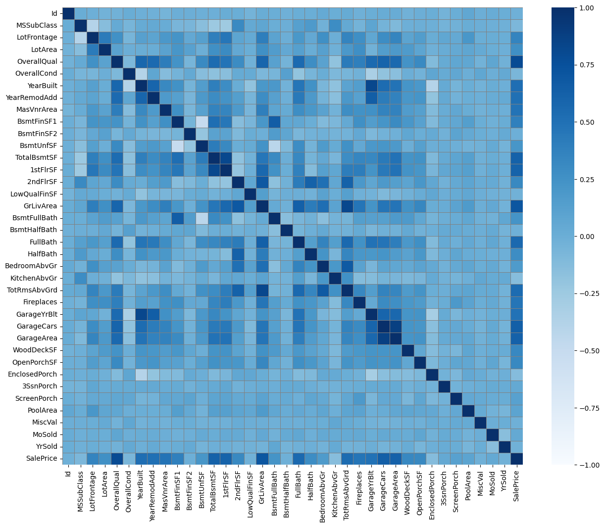
    


There are four cases of potential multicolinearity:
- GarageCars vs GarageArea 
- TotalBsmtSF vs 1stFlrSF
- YearBuilt vs GarageYrBlt
- GrLivArea vs TotRmsAbvGrd

This will help us reduce performance issues by removing highly correlated features.


```python
correlation = train.select_dtypes(exclude=['object']).corr()
correlation[['SalePrice']].sort_values(['SalePrice'], ascending=False)
```


<div>
<table border="1" class="dataframe">
  <thead>
    <tr style="text-align: right;">
      <th></th>
      <th>SalePrice</th>
    </tr>
  </thead>
  <tbody>
    <tr>
      <th>SalePrice</th>
      <td>1.000000</td>
    </tr>
    <tr>
      <th>OverallQual</th>
      <td>0.790982</td>
    </tr>
    <tr>
      <th>GrLivArea</th>
      <td>0.708624</td>
    </tr>
    <tr>
      <th>GarageCars</th>
      <td>0.640409</td>
    </tr>
    <tr>
      <th>GarageArea</th>
      <td>0.623431</td>
    </tr>
    <tr>
      <th>TotalBsmtSF</th>
      <td>0.613581</td>
    </tr>
    <tr>
      <th>1stFlrSF</th>
      <td>0.605852</td>
    </tr>
    <tr>
      <th>FullBath</th>
      <td>0.560664</td>
    </tr>
    <tr>
      <th>TotRmsAbvGrd</th>
      <td>0.533723</td>
    </tr>
    <tr>
      <th>YearBuilt</th>
      <td>0.522897</td>
    </tr>
    <tr>
      <th>YearRemodAdd</th>
      <td>0.507101</td>
    </tr>
    <tr>
      <th>GarageYrBlt</th>
      <td>0.486362</td>
    </tr>
    <tr>
      <th>MasVnrArea</th>
      <td>0.477493</td>
    </tr>
    <tr>
      <th>Fireplaces</th>
      <td>0.466929</td>
    </tr>
    <tr>
      <th>BsmtFinSF1</th>
      <td>0.386420</td>
    </tr>
    <tr>
      <th>LotFrontage</th>
      <td>0.351799</td>
    </tr>
    <tr>
      <th>WoodDeckSF</th>
      <td>0.324413</td>
    </tr>
    <tr>
      <th>2ndFlrSF</th>
      <td>0.319334</td>
    </tr>
    <tr>
      <th>OpenPorchSF</th>
      <td>0.315856</td>
    </tr>
    <tr>
      <th>HalfBath</th>
      <td>0.284108</td>
    </tr>
    <tr>
      <th>LotArea</th>
      <td>0.263843</td>
    </tr>
    <tr>
      <th>BsmtFullBath</th>
      <td>0.227122</td>
    </tr>
    <tr>
      <th>BsmtUnfSF</th>
      <td>0.214479</td>
    </tr>
    <tr>
      <th>BedroomAbvGr</th>
      <td>0.168213</td>
    </tr>
    <tr>
      <th>ScreenPorch</th>
      <td>0.111447</td>
    </tr>
    <tr>
      <th>PoolArea</th>
      <td>0.092404</td>
    </tr>
    <tr>
      <th>MoSold</th>
      <td>0.046432</td>
    </tr>
    <tr>
      <th>3SsnPorch</th>
      <td>0.044584</td>
    </tr>
    <tr>
      <th>BsmtFinSF2</th>
      <td>-0.011378</td>
    </tr>
    <tr>
      <th>BsmtHalfBath</th>
      <td>-0.016844</td>
    </tr>
    <tr>
      <th>MiscVal</th>
      <td>-0.021190</td>
    </tr>
    <tr>
      <th>Id</th>
      <td>-0.021917</td>
    </tr>
    <tr>
      <th>LowQualFinSF</th>
      <td>-0.025606</td>
    </tr>
    <tr>
      <th>YrSold</th>
      <td>-0.028923</td>
    </tr>
    <tr>
      <th>OverallCond</th>
      <td>-0.077856</td>
    </tr>
    <tr>
      <th>MSSubClass</th>
      <td>-0.084284</td>
    </tr>
    <tr>
      <th>EnclosedPorch</th>
      <td>-0.128578</td>
    </tr>
    <tr>
      <th>KitchenAbvGr</th>
      <td>-0.135907</td>
    </tr>
  </tbody>
</table>
</div>


```python
fig = plt.figure(figsize=(20,20))
for index in range(len(num_features.columns)):
    plt.subplot(10,5,index+1)
    sns.scatterplot(x=num_features.iloc[:,index], y='SalePrice', data=num_features.dropna())
fig.tight_layout(pad=1.0)
```


    
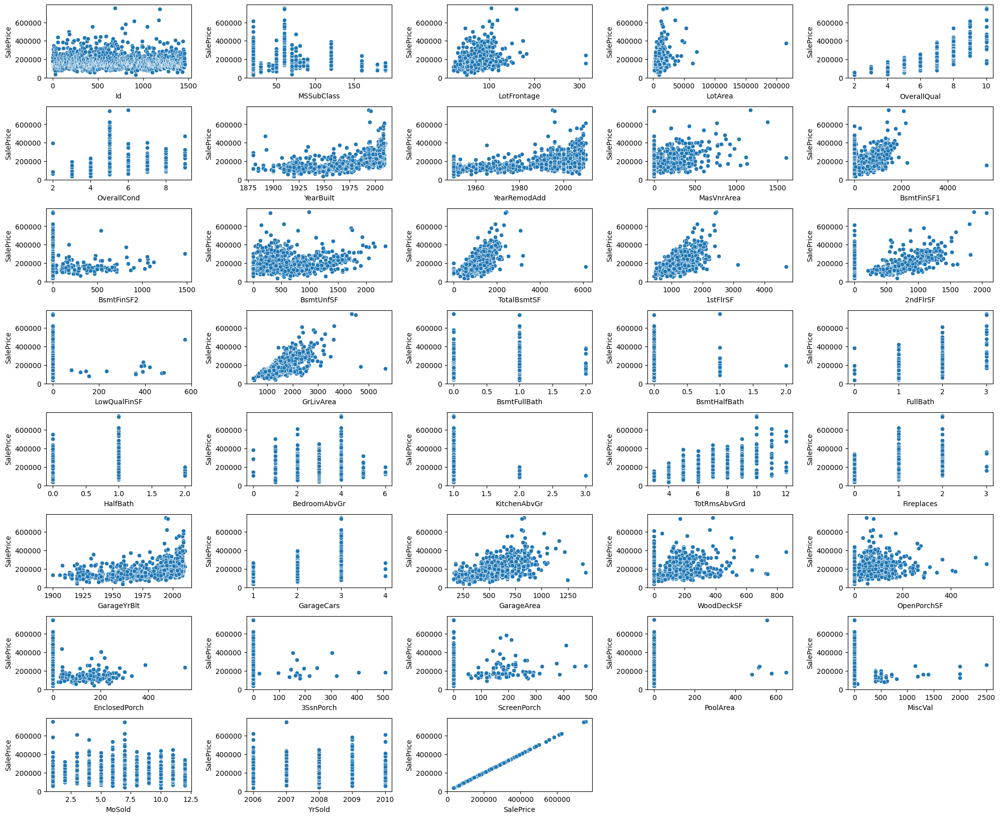
    


## 2. Data Cleaning


```python
train_copy = train.copy()
test_copy = test.copy()
```

## 2.1 Multicolinearity

Removing redundant columns to reduce multicollinearity. I've identified 4 pairs of features that have high correlation with each other from the bivariate analysis section above.
- GarageCars vs GarageArea 
- TotalBsmtSF vs 1stFlrSF
- YearBuilt vs GarageYrBlt
- GrLivArea vs TotRmsAbvGrd


```python
cols = ['GarageCars', 'GarageArea', 'TotalBsmtSF', '1stFlrSF', 'YearBuilt', 'GarageYrBlt', 'GrLivArea', 'TotRmsAbvGrd']

# 1. Correlation with SalePrice
corr_with_target = train_copy[cols].corrwith(train_copy['SalePrice'])

# 2. Missing percentage
missing_pct = train_copy[cols].isna().mean() * 100

# 3. Variance
variance_vals = train_copy[cols].var()

feature_stats = pd.DataFrame({
    'correlation_with_SalePrice': corr_with_target,
    'missing_percent': missing_pct,
    'variance': variance_vals
})
feature_stats
```


<div>
<table border="1" class="dataframe">
  <thead>
    <tr style="text-align: right;">
      <th></th>
      <th>correlation_with_SalePrice</th>
      <th>missing_percent</th>
      <th>variance</th>
    </tr>
  </thead>
  <tbody>
    <tr>
      <th>GarageCars</th>
      <td>0.640409</td>
      <td>0.000000</td>
      <td>0.558480</td>
    </tr>
    <tr>
      <th>GarageArea</th>
      <td>0.623431</td>
      <td>0.000000</td>
      <td>45712.510229</td>
    </tr>
    <tr>
      <th>TotalBsmtSF</th>
      <td>0.613581</td>
      <td>0.000000</td>
      <td>192462.361709</td>
    </tr>
    <tr>
      <th>1stFlrSF</th>
      <td>0.605852</td>
      <td>0.000000</td>
      <td>149450.079204</td>
    </tr>
    <tr>
      <th>YearBuilt</th>
      <td>0.522897</td>
      <td>0.000000</td>
      <td>912.215413</td>
    </tr>
    <tr>
      <th>GarageYrBlt</th>
      <td>0.486362</td>
      <td>5.547945</td>
      <td>609.582509</td>
    </tr>
    <tr>
      <th>GrLivArea</th>
      <td>0.708624</td>
      <td>0.000000</td>
      <td>276129.633363</td>
    </tr>
    <tr>
      <th>TotRmsAbvGrd</th>
      <td>0.533723</td>
      <td>0.000000</td>
      <td>2.641903</td>
    </tr>
  </tbody>
</table>
</div>


When deciding what features to remove, the idea is to keep features that will help better the prediction accuracy. This mean giving more info and we can discern that through the feature's correlation, missing percent, and variance. Higher correlation, lower missing values, and higher variance are good.

The feature statistics above will help decide which features to remove:
- GarageCars vs GarageArea: Keep GarageArea -> Although it has slightly lower correlation with SalePrice, it has much high variance as a continuous variable, which may result in better predictions.
- TotalBsmtSF vs 1stFlrSF: Keep 1stFlrSF -> Although stats are similar, it makes better sense contextually to keep the 1st floor area than the basement area as house buyers will prioritize first floor area more than basement.
- YearBuilt vs GarageYrBlt: Keep YearBlt -> Higher correlation, less missing values, higher variance, better context.
- GrLivArea vs TotRmsAbvGrd: Keep GrLivArea -> Higher correlation, higher variance.


```python
train_copy.drop(['GarageCars', 'TotalBsmtSF', 'GarageYrBlt', 'TotRmsAbvGrd'], axis=1, inplace=True)
test_copy.drop(['GarageCars', 'TotalBsmtSF', 'GarageYrBlt', 'TotRmsAbvGrd'], axis=1, inplace=True)
```

## 2.2 Missing values


```python
plt.figure(figsize=(25,8))
plt.title('Number of missing rows')
missing_count = pd.DataFrame(train_copy.isnull().mean()*100, columns=['sum']).sort_values(by=['sum'],ascending=False).head(20).reset_index()
missing_count.columns = ['features','percent']
ax = sns.barplot(x='features',y='percent', data = missing_count)

ax.bar_label(ax.containers[0], fmt="%.1f%%")

plt.tight_layout()
plt.show()
```


    
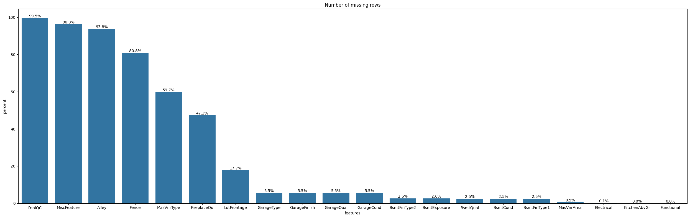
    


```python
fig,axes = plt.subplots(1,4, figsize=(15,5))
tmp = train_copy[['SalePrice', 'Alley', 'Fence', 'MasVnrType', 'FireplaceQu']].fillna("None")
sns.scatterplot(x=tmp['Alley'], y='SalePrice', data=tmp, ax = axes[0])
sns.scatterplot(x=tmp['Fence'], y='SalePrice', data=tmp, ax = axes[1])
sns.scatterplot(x=tmp['MasVnrType'], y='SalePrice', data=tmp, ax = axes[2])
sns.scatterplot(x=tmp['FireplaceQu'], y='SalePrice', data=tmp, ax = axes[3])
fig.tight_layout(pad=2.0)

```


    
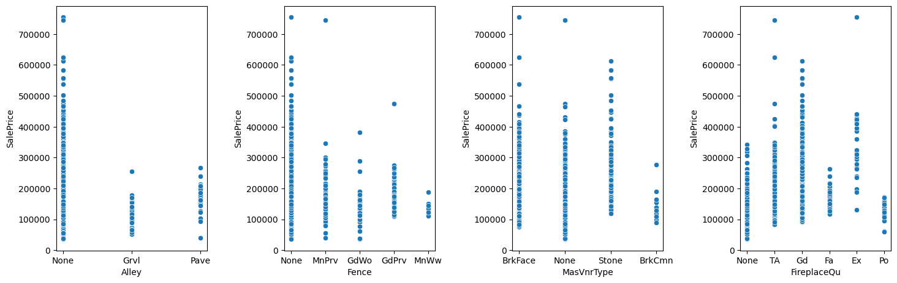
    


First I'll take a look at the feature with high amounts of missing values and decide if I can remove them. 

PoolQC - Indicates the quality of the pool, with missing values meaning no pool. There is a related feature called PoolArea that denotes the size of the pool, with 0 being no pool. Instinctually, a pool would increase the value of a house, but looking at the correlation analysis above, there does not seem to be a significant relationship between PoolArea (0.09) -> will remove PoolQC. Just keeping PoolArea will incorporate any benefits to SalePrice a pool could bring.

MiscFeature - Same logic, I'll just keep MiscVal to incorporate any correlation.

Alley - As a standalone feature, I'll take a closer look at the scatterplot for any relationship. There does not seem to be a significant relationship between SalePrice and the existence of an alley, therefore will remove feature.

Fence - The only feature that provide information regarding fences, will keep and fill missing with "None"

MasVnrType - The related MaxVnrArea feature seems to show a positive relationship with SalePrice, will keep this feature and fill missing values with "None". This feature also doesn't have extreme amounts of missing values (>90%)

FireplaceQu - The related Fireplaces feature seems to show a positive relationship with SalePrice, will keep this feature and fill missing values with "None". This feature also doesn't have extreme amounts of missing values (>90%)


```python
train_copy.drop(['PoolQC', 'MiscFeature', 'Alley'], axis=1, inplace=True)
train_copy[['Fence', 'MasVnrType', 'FireplaceQu']] = train_copy[['Fence', 'MasVnrType', 'FireplaceQu']].fillna("None")

test_copy.drop(['PoolQC', 'MiscFeature', 'Alley'], axis=1, inplace=True)
test_copy[['Fence', 'MasVnrType', 'FireplaceQu']] = train_copy[['Fence', 'MasVnrType', 'FireplaceQu']].fillna("None")
```

GarageType / GarageFinish / GarageQual / GarageCond
Missing values for the above signify no garage -> fill with "None"

BsmtQual / BsmtCond / BsmtExposure / BsmtFinType1 / BsmtFinType2
Missing values for the above signify no garage -> fill with "None"

Electrical - Populate electrical type with the most common electrical system SBrkr

MasVnrArea - Populate with average based on MaxVnrType

LotFrontage - Doesn't seem to be related to other features heavily, will populate missing values with median value


```python
cols = ['GarageType', 'GarageFinish', 'GarageQual', 'GarageCond', 'BsmtQual', 'BsmtCond', 'BsmtExposure', 'BsmtFinType1', 'BsmtFinType2']
train_copy[cols] = train_copy[cols].fillna("None")
test_copy[cols] = test_copy[cols].fillna("None")

train_copy[['Electrical']] = train_copy[['Electrical']].fillna("Sbrkr")
test_copy[['Electrical']] = test_copy[['Electrical']].fillna("Sbrkr")

train_copy['MasVnrArea'] = (
    train_copy.groupby('MasVnrType')['MasVnrArea']
              .transform(lambda x: x.fillna(x.mean()))
)
test_copy['MasVnrArea'] = (
    test_copy.groupby('MasVnrType')['MasVnrArea']
              .transform(lambda x: x.fillna(x.mean()))
)

train_copy['LotFrontage'] = train_copy['LotFrontage'].fillna(train_copy['LotFrontage'].median())
test_copy['LotFrontage'] = test_copy['LotFrontage'].fillna(test_copy['LotFrontage'].median())
```


```python
print(f"Any missing values: {train_copy.isna().any().any()}")
print(f"Number of missing values: {train_copy.isna().sum().sum()}")
```

    Any missing values: False
    Number of missing values: 0


```python
print(f"Any missing values: {test_copy.isna().any().any()}")
print(f"Number of missing values: {test_copy.isna().sum().sum()}")
```

    Any missing values: True
    Number of missing values: 20


```python
# # Show amount of missing values

# plt.figure(figsize=(25,8))
# plt.title('Number of missing rows')
# missing_count = pd.DataFrame(train_copy.isnull().mean()*100, columns=['sum']).sort_values(by=['sum'],ascending=False).head(20).reset_index()
# missing_count.columns = ['features','percent']
# ax = sns.barplot(x='features',y='percent', data = missing_count)

# ax.bar_label(ax.containers[0], fmt="%.1f%%")

# plt.tight_layout()
# plt.show()
```

## 2.3 Outliers

Taking a look at the distributions for the continuous numerical features we can see that most of the features are non-normally distributed. I will log-transform these features to normalize the values, hopefully inproving prediction accuracy. 

I'm choosing to log-transform because of the simplicity, but also a log transformation handles zero data (which has importance in these features signifying non-existant) and positively skewed data (which all the features are).


```python
cont_num_var = ['LotFrontage', 'LotArea', 'MasVnrArea', 'BsmtFinSF1',
       'BsmtFinSF2', 'BsmtUnfSF', '1stFlrSF', '2ndFlrSF',
       'LowQualFinSF', 'GrLivArea', 'GarageArea', 'WoodDeckSF',
       'OpenPorchSF', 'EnclosedPorch', '3SsnPorch', 'ScreenPorch', 'PoolArea',
       'MiscVal']
```


```python
fig = plt.figure(figsize=(12, 18))

for i, col in enumerate(cont_num_var):
    if col in train.columns:
        fig.add_subplot(9, 4, i + 1)
        sns.histplot(
            train[col].dropna(), kde=True,
            stat="density", kde_kws=dict(cut=3),
            alpha=.4, edgecolor=(1, 1, 1, .4)
        )
        plt.xlabel(col)

plt.tight_layout(pad=1.0)
```


    
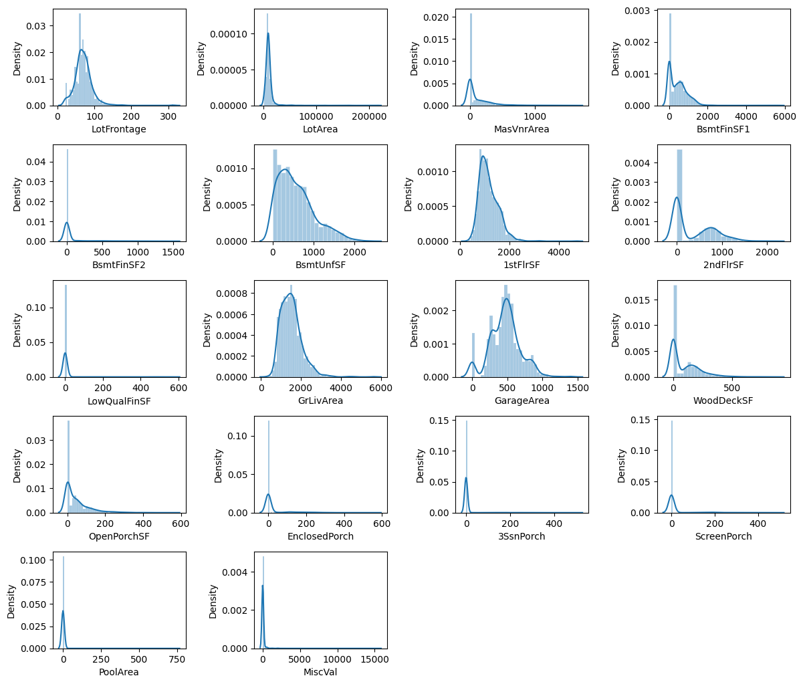
    


```python
train_copy[cont_num_var].skew()
# train_copy[[c + '_log' for c in cols]].skew()
```


    LotFrontage       2.409147
    LotArea          12.207688
    MasVnrArea        2.677700
    BsmtFinSF1        1.685503
    BsmtFinSF2        4.255261
    BsmtUnfSF         0.920268
    1stFlrSF          1.376757
    2ndFlrSF          0.813030
    LowQualFinSF      9.011341
    GrLivArea         1.366560
    GarageArea        0.179981
    WoodDeckSF        1.541376
    OpenPorchSF       2.364342
    EnclosedPorch     3.089872
    3SsnPorch        10.304342
    ScreenPorch       4.122214
    PoolArea         14.828374
    MiscVal          24.476794
    dtype: float64


```python
for col in cont_num_var:
    train_copy[col] = np.log1p(train_copy[col])

for col in cont_num_var:
    test_copy[col] = np.log1p(test_copy[col])    
```


```python
train_copy[cont_num_var].skew()
```


    LotFrontage      -0.870006
    LotArea          -0.137404
    MasVnrArea        0.502545
    BsmtFinSF1       -0.618410
    BsmtFinSF2        2.523694
    BsmtUnfSF        -2.186504
    1stFlrSF          0.080114
    2ndFlrSF          0.289643
    LowQualFinSF      7.460317
    GrLivArea        -0.006140
    GarageArea       -3.482604
    WoodDeckSF        0.153537
    OpenPorchSF      -0.023397
    EnclosedPorch     2.112275
    3SsnPorch         7.734975
    ScreenPorch       3.150409
    PoolArea         14.363102
    MiscVal           5.170704
    dtype: float64


# 3. Feature Engineering

Getting numerical dummies for non-numeric features.


```python
train_dum = pd.get_dummies(
    train_copy,
    columns=train_copy.select_dtypes(include='object').columns,
    drop_first=True
)

test_dum = pd.get_dummies(
    test_copy,
    columns=test_copy.select_dtypes(include='object').columns,
    drop_first=True
)

# Align test to train
train_final, test_final = train_dum.align(test_dum, join='left', axis=1, fill_value=0)
test_final.drop(['SalePrice'], axis=1, inplace=True)

train_final.info()
```

    <class 'pandas.core.frame.DataFrame'>
    RangeIndex: 1460 entries, 0 to 1459
    Columns: 249 entries, Id to SaleCondition_Partial
    dtypes: bool(215), float64(18), int64(16)
    memory usage: 694.5 KB


```python
test_final.info()
```

    <class 'pandas.core.frame.DataFrame'>
    RangeIndex: 1459 entries, 0 to 1458
    Columns: 248 entries, Id to SaleCondition_Partial
    dtypes: bool(198), float64(20), int64(30)
    memory usage: 852.2 KB


```python
train_final['SalePrice'] = np.log(train_copy['SalePrice'])

plt.figure()
sns.histplot(
    train_final.SalePrice, kde=True,
    stat="percent", kde_kws=dict(cut=3),
    alpha=.4, edgecolor=(1, 1, 1, .4)
)
plt.title('Distribution of SalePrice')
plt.show()
```


    
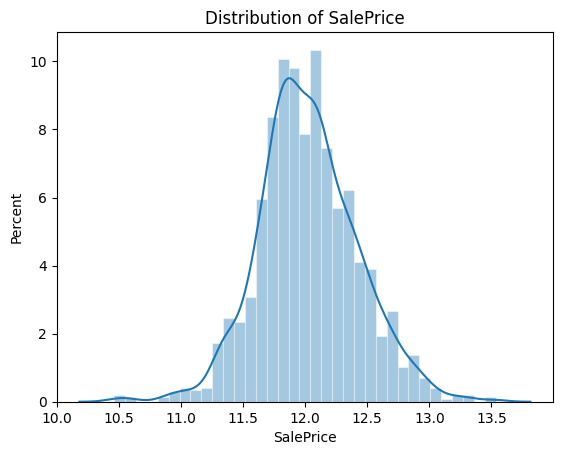
    


```python
# X = train_copy.copy().dropna()
# y = X.pop('SalePrice')

# X.head(10)

# features_num = X.select_dtypes(exclude='object').columns()
# features_cat = X.select_dtypes(include='object').columns()

# preprocessor = make_column_transformer(
#     (StandardScaler(), features_num),
#     (OneHotEncoder(), features_cat),
# )

# X_train, X_valid, y_train, y_valid = train_test_split(X, y, random_state = 1)

```


```python
# X = train_final.drop(['SalePrice'], axis=1)
# y = train_final.SalePrice

# # Split into validation and training data
# train_X, val_X, train_y, val_y = train_test_split(X, y, random_state=1)

#--------

train_X = train_final.drop(['SalePrice'], axis=1)
train_y = train_final.SalePrice
```


```python
def inv_y(transformed_y):
    return np.exp(transformed_y)

# Series to collate mean absolute errors for each algorithm
# mae_compare = pd.Series()
# mae_compare.index.name = 'Algorithm'

# Specify Model ================================
# iowa_model = DecisionTreeRegressor(random_state=1)
# # Fit Model
# iowa_model.fit(train_X, train_y)

# # Make validation predictions and calculate mean absolute error
# val_predictions = iowa_model.predict(val_X)
# val_mae = mean_absolute_error(inv_y(val_predictions), inv_y(val_y))
# mae_compare['DecisionTree'] = val_mae
# # print("Validation MAE for Decision Tree when not specifying max_leaf_nodes: {:,.0f}".format(val_mae))

# Decision Tree. Using best value for max_leaf_nodes ==============
# iowa_model = DecisionTreeRegressor(max_leaf_nodes=90, random_state=1)
# iowa_model.fit(train_X, train_y)
# val_predictions = iowa_model.predict(val_X)
# val_mae = mean_absolute_error(inv_y(val_predictions), inv_y(val_y))
# mae_compare['DecisionTree_opt_max_leaf_nodes'] = val_mae
# # print("Validation MAE for Decision Tree with best value of max_leaf_nodes: {:,.0f}".format(val_mae))

# Random Forest. Define the model. =============================
rf_model = RandomForestRegressor(random_state=5)
rf_model.fit(train_X, train_y)
# rf_val_predictions = rf_model.predict(val_X)
# rf_val_mae = mean_absolute_error(inv_y(rf_val_predictions), inv_y(val_y))

# # mae_compare['RandomForest'] = rf_val_mae
# print("Validation MAE for Random Forest Model: {:,.0f}".format(rf_val_mae))
# print("ok")


# # XGBoost. Define the model. ======================================
# # xgb_model = XGBRegressor(n_estimators=1000, learning_rate=0.05)
# # xgb_model.fit(train_X, train_y, early_stopping_rounds=5, 
# #               eval_set=[(val_X,val_y)], verbose=False)
# # xgb_val_predictions = xgb_model.predict(val_X)
# # xgb_val_mae = mean_absolute_error(inv_y(xgb_val_predictions), inv_y(val_y))

# # mae_compare['XGBoost'] = xgb_val_mae
# # print("Validation MAE for XGBoost Model: {:,.0f}".format(xgb_val_mae))

# # Linear Regression =================================================
# linear_model = LinearRegression()
# linear_model.fit(train_X, train_y)
# linear_val_predictions = linear_model.predict(val_X)
# linear_val_mae = mean_absolute_error(inv_y(linear_val_predictions), inv_y(val_y))

# mae_compare['LinearRegression'] = linear_val_mae
# # print("Validation MAE for Linear Regression Model: {:,.0f}".format(linear_val_mae))

# # Lasso ==============================================================
# lasso_model = Lasso(alpha=0.0005, random_state=5)
# lasso_model.fit(train_X, train_y)
# lasso_val_predictions = lasso_model.predict(val_X)
# lasso_val_mae = mean_absolute_error(inv_y(lasso_val_predictions), inv_y(val_y))

# mae_compare['Lasso'] = lasso_val_mae
# # print("Validation MAE for Lasso Model: {:,.0f}".format(lasso_val_mae))

# # Ridge ===============================================================
# ridge_model = Ridge(alpha=0.002, random_state=5)
# ridge_model.fit(train_X, train_y)
# ridge_val_predictions = ridge_model.predict(val_X)
# ridge_val_mae = mean_absolute_error(inv_y(ridge_val_predictions), inv_y(val_y))

# mae_compare['Ridge'] = ridge_val_mae
# # print("Validation MAE for Ridge Regression Model: {:,.0f}".format(ridge_val_mae))

# # ElasticNet ===========================================================
# elastic_net_model = ElasticNet(alpha=0.02, random_state=5, l1_ratio=0.7)
# elastic_net_model.fit(train_X, train_y)
# elastic_net_val_predictions = elastic_net_model.predict(val_X)
# elastic_net_val_mae = mean_absolute_error(inv_y(elastic_net_val_predictions), inv_y(val_y))

# mae_compare['ElasticNet'] = elastic_net_val_mae
# # print("Validation MAE for Elastic Net Model: {:,.0f}".format(elastic_net_val_mae))

# # KNN Regression ========================================================
# # knn_model = KNeighborsRegressor()
# # knn_model.fit(train_X, train_y)
# # knn_val_predictions = knn_model.predict(val_X)
# # knn_val_mae = mean_absolute_error(inv_y(knn_val_predictions), inv_y(val_y))

# # mae_compare['KNN'] = knn_val_mae
# # # print("Validation MAE for KNN Model: {:,.0f}".format(knn_val_mae))

# # Gradient Boosting Regression ==========================================
# gbr_model = GradientBoostingRegressor(n_estimators=300, learning_rate=0.05, 
#                                       max_depth=4, random_state=5)
# gbr_model.fit(train_X, train_y)
# gbr_val_predictions = gbr_model.predict(val_X)
# gbr_val_mae = mean_absolute_error(inv_y(gbr_val_predictions), inv_y(val_y))

# mae_compare['GradientBoosting'] = gbr_val_mae
# # print("Validation MAE for Gradient Boosting Model: {:,.0f}".format(gbr_val_mae))

# # # Ada Boost Regression ================================================
# # ada_model = AdaBoostRegressor(n_estimators=300, learning_rate=0.05, random_state=5)
# # ada_model.fit(train_X, train_y)
# # ada_val_predictions = ada_model.predict(val_X)
# # ada_val_mae = mean_absolute_error(inv_y(ada_val_predictions), inv_y(val_y))

# # mae_compare['AdaBoost'] = ada_val_mae
# # # print("Validation MAE for Ada Boost Model: {:,.0f}".format(ada_val_mae))

# # # Support Vector Regression ===========================================
# # svr_model = SVR(kernel='linear')
# # svr_model.fit(train_X, train_y)
# # svr_val_predictions = svr_model.predict(val_X)
# # svr_val_mae = mean_absolute_error(inv_y(svr_val_predictions), inv_y(val_y))

# # mae_compare['SVR'] = svr_val_mae
# # print("Validation MAE for SVR Model: {:,.0f}".format(svr_val_mae))

# print('MAE values for different algorithms:')
# mae_compare.sort_values(ascending=True).round()
```


```python
from tensorflow import keras
from keras import layers

nn_model = keras.Sequential([
    layers.Dense(1024, activation='relu', input_shape=[248]),
    layers.Dropout(0.3),
    layers.BatchNormalization(),
    layers.Dense(2048, activation='relu'),
    layers.Dropout(0.3),
    layers.BatchNormalization(),
    layers.Dense(1024, activation='relu'),
    layers.Dropout(0.3),
    layers.BatchNormalization(),
    layers.Dense(512, activation='relu'),
    layers.Dropout(0.3),
    layers.BatchNormalization(),
    layers.Dense(256, activation='relu'),
    layers.Dropout(0.3),
    layers.BatchNormalization(),
    layers.Dense(1),
])

nn_model.compile(
    optimizer='adam',
    loss='mae',
)

history = nn_model.fit(
    train_X, train_y,
    validation_data=(val_X, val_y),
    batch_size=256,
    epochs=100,
    verbose=0,
)


# Show the learning curves
history_df = pd.DataFrame(history.history)
history_df.loc[:, ['loss', 'val_loss']].plot()
```


    <Axes: >


    
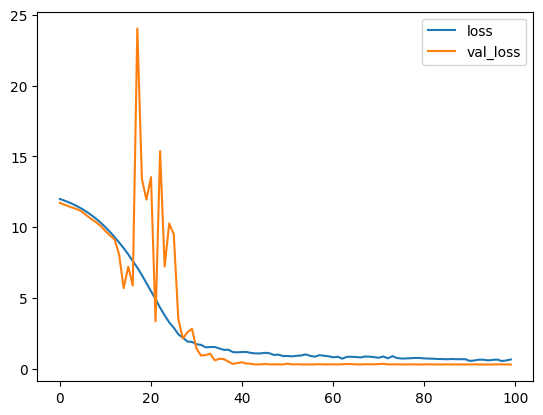
    


# Final Model and Prediction


```python
final_model = rf_model
```


```python
final_pred = final_model.predict(test_final)
saleprice_pred = inv_y(final_pred)

# Ensure it's 1D
saleprice_pred = np.ravel(saleprice_pred)

output = pd.DataFrame({'Id': test_final.Id,
                       'SalePrice': saleprice_pred})

output.to_csv('submission.csv', index=False)
```


```python

```


```python

```
